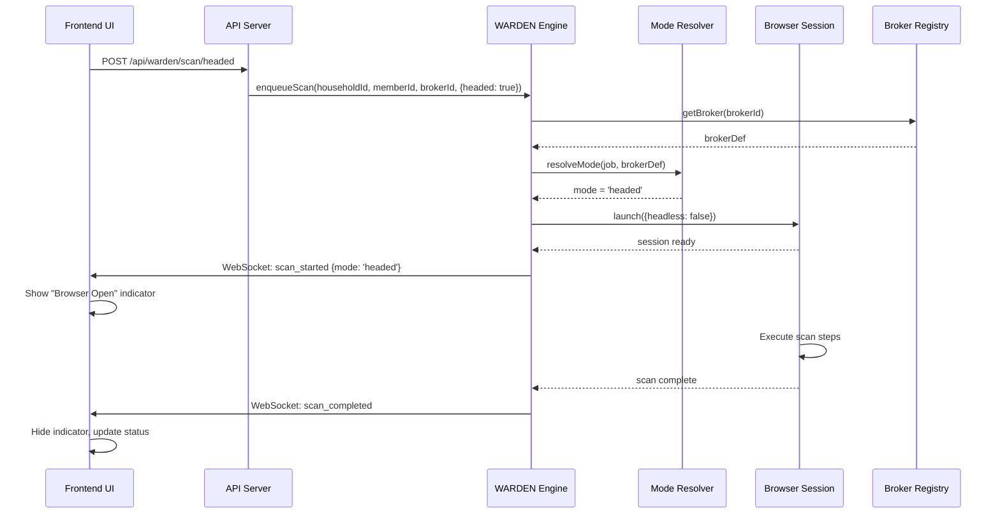

# Design Document: WARDEN Headed/Headless Browser Mode

## 1. Introduction

This document provides the technical design for implementing headed/headless browser mode selection in the WARDEN data broker removal system. The design enables two distinct execution paths: fully automated headless scanning for brokers without bot protection, and user-initiated headed (visible browser) scanning for CAPTCHA-protected brokers.

### 1.1 Design Goals

1. **Per-Broker Mode Configuration**: Allow broker definitions to specify whether they require headed mode
2. **User Override Capability**: Enable users to manually trigger headed scans via API and UI
3. **Backward Compatibility**: Maintain compatibility with existing broker definitions and the global `WARDEN_HEADED_MODE` env var
4. **Session Management**: Properly manage and clean up visible browser windows
5. **Status Visibility**: Provide clear UI indicators when headed scans are active

### 1.2 Design Constraints

- Must not break existing broker definitions
- Must respect `WARDEN_MAX_CONCURRENT_SESSIONS` limit for both modes
- Must provide graceful degradation when headed mode fails
- Must maintain audit trail of which mode was used for each scan

## 2. High-Level Design

### 2.1 System Architecture

```
┌─────────────────────────────────────────────────────────────────┐
│                         WARDEN Engine                            │
│                                                                   │
│  ┌──────────────┐      ┌──────────────┐      ┌──────────────┐  │
│  │ Scan Queue   │─────▶│ Mode         │─────▶│ Browser      │  │
│  │              │      │ Resolver     │      │ Session      │  │
│  │ - job_id     │      │              │      │ Pool         │  │
│  │ - broker_id  │      │ Priority:    │      │              │  │
│  │ - member_id  │      │ 1. Override  │      │ Headless: N  │  │
│  │ - headed?    │      │ 2. Broker    │      │ Headed: M    │  │
│  └──────────────┘      │ 3. Env Var   │      └──────────────┘  │
│                        └──────────────┘                          │
└─────────────────────────────────────────────────────────────────┘
         │                       │                       │
         │                       │                       │
         ▼                       ▼                       ▼
┌─────────────────┐    ┌─────────────────┐    ┌─────────────────┐
│ Broker Registry │    │ API Endpoints   │    │ WebSocket       │
│                 │    │                 │    │ Events          │
│ - Load defs     │    │ POST /scan      │    │                 │
│ - Validate      │    │ POST /scan/     │    │ scan_started    │
│ - Get mode      │    │      headed     │    │ scan_completed  │
└─────────────────┘    └─────────────────┘    └─────────────────┘
         │                       │                       │
         │                       │                       │
         ▼                       ▼                       ▼
┌─────────────────────────────────────────────────────────────────┐
│                         Frontend UI                              │
│                                                                   │
│  ┌──────────────────────────────────────────────────────────┐  │
│  │ Member Scan Status View                                   │  │
│  │                                                            │  │
│  │  Broker: CyberBackgroundChecks                            │  │
│  │  Status: not_found                                        │  │
│  │  Last Scan: 2026-03-25 10:30 AM (headless)               │  │
│  │  [Scan with Browser] ← Manual headed scan trigger        │  │
│  │                                                            │  │
│  │  ⚠️ This broker requires manual interaction               │  │
│  └──────────────────────────────────────────────────────────┘  │
└─────────────────────────────────────────────────────────────────┘
```

### 2.2 Data Flow

#### 2.2.1 Automated Scan Flow (Headless)

```
1. Cron triggers daily scan
2. WARDEN Engine enqueues scan jobs for all members × brokers
3. For each job:
   a. Mode Resolver checks broker.requires_headed_mode → false
   b. Browser Session launches with headless: true
   c. Scan executes fully automated
   d. Results stored, WebSocket notifies UI
```

#### 2.2.2 Manual Headed Scan Flow

```
1. User clicks "Scan with Browser" button in UI
2. UI calls POST /api/warden/scan/headed
3. API enqueues scan job with headed: true override
4. WARDEN Engine:
   a. Mode Resolver sees override → headed mode
   b. Browser Session launches with headless: false (visible)
   c. Browser window opens on user's screen
   d. User interacts with CAPTCHA/bot challenge
   e. Scan continues after user interaction
   f. Results stored, WebSocket notifies UI
5. UI shows "Browser Open" indicator during scan
```

### 2.3 Component Interactions



## 3. Low-Level Design

### 3.1 Data Models

#### 3.1.1 Broker Definition Extension

```javascript
// server/warden/brokers/<broker-id>.json
{
  "id": "spokeo",
  "name": "Spokeo",
  "search_url": "...",
  "opt_out_url": "...",
  "requires_pii": ["name", "city", "state"],
  "verification_method": "email",
  
  // NEW FIELD
  "requires_headed_mode": true,  // Optional, defaults to false
  
  "steps": [...]
}
```

#### 3.1.2 Scan Job Extension

```javascript
// Internal scan job structure
{
  id: 'job_abc123',
  householdId: 'hh_xyz',
  memberId: 'mem_123',
  brokerId: 'spokeo',
  brokerDef: {...},
  memberData: {...},
  householdData: {...},
  priority: 1,
  enqueuedAt: '2026-03-25T10:00:00Z',
  
  // NEW FIELDS
  headedOverride: true | false | undefined,  // User override
  resolvedMode: 'headed' | 'headless',       // Final resolved mode
}
```

#### 3.1.3 Broker Scan Store Extension

```javascript
// data/broker-scans/<household_id>/<member_id>.json
{
  "household_id": "hh_xyz",
  "member_id": "mem_123",
  "brokers": {
    "spokeo": {
      "status": "not_found",
      "last_scan_at": "2026-03-25T10:30:00Z",
      "last_scan_mode": "headed",  // NEW FIELD
      "scan_history": [
        {
          "timestamp": "2026-03-25T10:30:00Z",
          "status": "not_found",
          "mode": "headed"  // NEW FIELD
        }
      ]
    }
  }
}
```

#### 3.1.4 WebSocket Event Extension

```javascript
// warden:scan_started event
{
  householdId: 'hh_xyz',
  memberId: 'mem_123',
  brokerId: 'spokeo',
  mode: 'headed'  // NEW FIELD: 'headed' | 'headless'
}

// warden:scan_completed event
{
  householdId: 'hh_xyz',
  memberId: 'mem_123',
  brokerId: 'spokeo',
  status: 'not_found',
  mode: 'headed'  // NEW FIELD
}

// warden:scan_error event
{
  householdId: 'hh_xyz',
  memberId: 'mem_123',
  brokerId: 'spokeo',
  error: 'browser_launch_failed',
  mode: 'headed'  // NEW FIELD
}
```

### 3.2 Code Structure

#### 3.2.1 Mode Resolver (New Module)

```javascript
// server/warden/mode-resolver.js

/**
 * Resolves browser mode for a scan job.
 * Priority: override > broker config > env var > default (headless)
 */
export class ModeResolver {
  /**
   * @param {object} job - Scan job with optional headedOverride
   * @param {object} brokerDef - Broker definition with optional requires_headed_mode
   * @param {boolean} globalHeadedMode - WARDEN_HEADED_MODE env var
   * @returns {'headed' | 'headless'}
   */
  static resolve(job, brokerDef, globalHeadedMode = false) {
    // Priority 1: User override
    if (job.headedOverride === true) return 'headed';
    if (job.headedOverride === false) return 'headless';
    
    // Priority 2: Broker configuration
    if (brokerDef.requires_headed_mode === true) return 'headed';
    if (brokerDef.requires_headed_mode === false) return 'headless';
    
    // Priority 3: Global env var (deprecated)
    if (globalHeadedMode) {
      console.warn('[mode-resolver] Using deprecated WARDEN_HEADED_MODE env var. Use per-broker requires_headed_mode instead.');
      return 'headed';
    }
    
    // Default: headless
    return 'headless';
  }
}
```

#### 3.2.2 WARDEN Engine Updates

```javascript
// server/warden/warden-engine.js

import { ModeResolver } from './mode-resolver.js';

export class WardenEngine {
  constructor({ eventBus, escalationHandler, ws, householdStore, locationStore, dataDir } = {}) {
    // ... existing constructor code ...
    
    this._activeHeadedSessions = 0;  // NEW: Track headed sessions separately
  }

  /**
   * Enqueue a scan with optional headed mode override.
   * @param {string} householdId
   * @param {object} options - { memberId?, brokerId?, headed? }
   */
  async enqueueScan(householdId, { memberId, brokerId, headed } = {}) {
    // ... existing validation code ...
    
    for (const member of members) {
      const piiAvailable = await this._checkPiiAvailability(member, household);
      const brokers = brokerId
        ? [this.brokerRegistry.getBroker(brokerId)].filter(Boolean)
        : this.brokerRegistry.getBrokersForMember(piiAvailable);

      for (const broker of brokers) {
        this._queue.push({
          id: `job_${randomUUID().slice(0, 8)}`,
          householdId,
          memberId: member.id,
          memberData: member,
          householdData: household,
          brokerId: broker.id,
          brokerDef: broker,
          priority: 1,
          enqueuedAt: new Date().toISOString(),
          headedOverride: headed,  // NEW: Store override
        });
        jobCount++;
      }
    }
    
    // ... existing drain queue code ...
  }

  async _executeJob(job) {
    const { householdId, memberId, brokerId, brokerDef, memberData, householdData } = job;

    // NEW: Resolve browser mode
    const mode = ModeResolver.resolve(
      job,
      brokerDef,
      process.env.WARDEN_HEADED_MODE === 'true'
    );
    const headless = mode === 'headless';
    
    // Store resolved mode in job for audit
    job.resolvedMode = mode;

    console.log(`[warden] Starting scan job=${job.id} broker=${brokerId} member=${sanitizeString(memberId)} mode=${mode}`);

    // NEW: Emit with mode
    this._emitEvent('broker_scan_started', { householdId, memberId, brokerId, mode });
    this.ws('warden:scan_started', { householdId, memberId, brokerId, mode });

    // ... existing PII decryption code ...

    // Launch browser session with resolved mode
    const session = new BrowserSession();
    try {
      await session.launch({ headless });
      
      // NEW: Track headed sessions
      if (!headless) {
        this._activeHeadedSessions++;
      }
    } catch (err) {
      console.error(`[warden] Browser launch failed (mode=${mode}): ${sanitizeString(err.message)}`);
      this.brokerScanStore.updateBrokerStatus(
        householdId,
        memberId,
        brokerId,
        'error',
        { error: 'browser_launch_failed', mode }
      );
      this.ws('warden:scan_error', { householdId, memberId, brokerId, error: 'browser_launch_failed', mode });
      return;
    }

    try {
      // ... existing scan execution code ...
      
      // NEW: Store mode in broker status
      this.brokerScanStore.updateBrokerStatus(
        householdId,
        memberId,
        brokerId,
        finalStatus,
        { ...result.error ? { error: result.error } : {}, mode }
      );

      // NEW: Emit with mode
      this._emitEvent('broker_scan_completed', { householdId, memberId, brokerId, status: finalStatus, mode });
      this.ws('warden:scan_completed', { householdId, memberId, brokerId, status: finalStatus, mode });

    } finally {
      await session.close();
      
      // NEW: Track headed sessions
      if (!headless) {
        this._activeHeadedSessions--;
      }
      
      memberPii = null;
    }
  }
}
```

#### 3.2.3 Broker Registry Updates

```javascript
// server/warden/broker-registry.js

export class BrokerRegistry {
  /**
   * Validate a broker definition.
   * @param {object} def - Broker definition
   * @throws {Error} if validation fails
   */
  _validateBroker(def) {
    // ... existing validation code ...
    
    // NEW: Validate requires_headed_mode if present
    if ('requires_headed_mode' in def) {
      if (typeof def.requires_headed_mode !== 'boolean') {
        throw new Error(`Broker ${def.id}: requires_headed_mode must be boolean`);
      }
    }
  }
}
```

#### 3.2.4 Broker Scan Store Updates

```javascript
// server/warden/broker-scan-store.js

export class BrokerScanStore {
  /**
   * Update broker status with mode tracking.
   * @param {string} householdId
   * @param {string} memberId
   * @param {string} brokerId
   * @param {string} status
   * @param {object} metadata - { error?, mode? }
   */
  updateBrokerStatus(householdId, memberId, brokerId, status, metadata = {}) {
    // ... existing code ...
    
    const now = new Date().toISOString();
    const brokerStatus = {
      status,
      last_scan_at: now,
      last_scan_mode: metadata.mode || 'headless',  // NEW: Track mode
      ...(metadata.error && { error: metadata.error }),
    };

    // ... existing storage code ...
    
    // NEW: Add mode to scan history
    if (!current.brokers[brokerId].scan_history) {
      current.brokers[brokerId].scan_history = [];
    }
    current.brokers[brokerId].scan_history.push({
      timestamp: now,
      status,
      mode: metadata.mode || 'headless',  // NEW
    });
    
    // ... existing save code ...
  }
}
```

#### 3.2.5 API Endpoint (New)

```javascript
// server/api/routes.js

/**
 * POST /api/warden/scan/headed
 * Trigger a headed (visible browser) scan for a specific member and broker.
 * 
 * Body: { household_id, member_id, broker_id }
 * Response: { queued: true, job_id: string }
 */
router.post('/warden/scan/headed', async (req, res) => {
  const { household_id, member_id, broker_id } = req.body;

  // Validate required fields
  if (!household_id || !member_id || !broker_id) {
    return res.status(400).json({
      error: 'Missing required fields',
      required: ['household_id', 'member_id', 'broker_id'],
    });
  }

  // Validate household exists
  const household = await householdStore.getHousehold(household_id).catch(() => null);
  if (!household) {
    return res.status(404).json({ error: 'Household not found' });
  }

  // Validate member exists
  const member = (household.members || []).find(m => m.id === member_id);
  if (!member) {
    return res.status(404).json({ error: 'Member not found' });
  }

  // Validate broker exists
  const broker = wardenEngine.brokerRegistry.getBroker(broker_id);
  if (!broker) {
    return res.status(404).json({ error: 'Broker not found' });
  }

  // Enqueue headed scan
  const result = await wardenEngine.enqueueScan(household_id, {
    memberId: member_id,
    brokerId: broker_id,
    headed: true,  // Force headed mode
  });

  if (result.queued) {
    res.json({
      queued: true,
      job_id: result.jobs > 0 ? `job_${Date.now()}` : null,
      message: 'Headed scan queued. Browser will open shortly.',
    });
  } else {
    res.status(500).json({ error: result.error || 'Failed to queue scan' });
  }
});
```

#### 3.2.6 UI Component (New)

```javascript
// src/components/BrokerScanStatus.jsx

import { useState } from 'react';
import { apiUrl } from '../lib/backend-url.js';

export function BrokerScanStatus({ householdId, memberId, broker, scanStatus }) {
  const [loading, setLoading] = useState(false);
  const [notification, setNotification] = useState(null);

  const handleHeadedScan = async () => {
    setLoading(true);
    try {
      const response = await fetch(apiUrl('/api/warden/scan/headed'), {
        method: 'POST',
        headers: { 'Content-Type': 'application/json' },
        body: JSON.stringify({
          household_id: householdId,
          member_id: memberId,
          broker_id: broker.id,
        }),
      });

      const data = await response.json();
      
      if (response.ok) {
        setNotification({
          type: 'success',
          message: 'Browser will open shortly. Please complete the CAPTCHA.',
        });
      } else {
        setNotification({
          type: 'error',
          message: data.error || 'Failed to start headed scan',
        });
      }
    } catch (err) {
      setNotification({
        type: 'error',
        message: 'Network error. Please try again.',
      });
    } finally {
      setLoading(false);
    }
  };

  return (
    <div className="broker-scan-status">
      <div className="broker-info">
        <h4>{broker.name}</h4>
        <div className="status">
          Status: <span className={`status-${scanStatus?.status}`}>
            {scanStatus?.status || 'not_scanned'}
          </span>
        </div>
        {scanStatus?.last_scan_at && (
          <div className="last-scan">
            Last Scan: {new Date(scanStatus.last_scan_at).toLocaleString()}
            {scanStatus.last_scan_mode && (
              <span className="mode-badge">{scanStatus.last_scan_mode}</span>
            )}
          </div>
        )}
      </div>

      {broker.requires_headed_mode && (
        <div className="warning">
          ⚠️ This broker requires manual interaction
        </div>
      )}

      <button
        onClick={handleHeadedScan}
        disabled={loading}
        className="btn-headed-scan"
      >
        {loading ? 'Queueing...' : 'Scan with Browser'}
      </button>

      {notification && (
        <div className={`notification notification-${notification.type}`}>
          {notification.message}
        </div>
      )}
    </div>
  );
}
```

### 3.3 Configuration

#### 3.3.1 Environment Variables

```bash
# .env

# DEPRECATED: Global headed mode (use per-broker requires_headed_mode instead)
WARDEN_HEADED_MODE=false

# Maximum concurrent browser sessions (applies to both headed and headless)
WARDEN_MAX_CONCURRENT_SESSIONS=2
```

#### 3.3.2 Broker Definition Updates

```json
// server/warden/brokers/cyberbackgroundchecks.json
{
  "id": "cyberbackgroundchecks",
  "name": "CyberBackgroundChecks",
  "requires_headed_mode": true,
  ...
}

// server/warden/brokers/spokeo.json
{
  "id": "spokeo",
  "name": "Spokeo",
  "requires_headed_mode": true,
  ...
}
```

## 4. Implementation Phases

### Phase 1: Core Infrastructure
- Create `mode-resolver.js` module
- Update `Scan Job` data structure
- Update `Broker Definition` schema
- Update `Broker Registry` validation

### Phase 2: WARDEN Engine Integration
- Update `enqueueScan()` to accept `headed` parameter
- Update `_executeJob()` to resolve and use mode
- Add headed session tracking
- Update WebSocket events with mode field

### Phase 3: Storage & Audit
- Update `Broker Scan Store` to track mode
- Add mode to scan history
- Update WebSocket event schemas

### Phase 4: API & UI
- Add `POST /api/warden/scan/headed` endpoint
- Create `BrokerScanStatus` UI component
- Add "Scan with Browser" button
- Add mode indicators in UI

### Phase 5: Broker Updates
- Update CyberBackgroundChecks definition
- Update Spokeo definition
- Add deprecation warning for `WARDEN_HEADED_MODE`

### Phase 6: Testing & Documentation
- Unit tests for `ModeResolver`
- Integration tests for headed scans
- Update API documentation
- Update WARDEN demo guide

## 5. Testing Strategy

### 5.1 Unit Tests

```javascript
// server/tests/mode-resolver.test.js

describe('ModeResolver', () => {
  test('override takes precedence over broker config', () => {
    const job = { headedOverride: true };
    const broker = { requires_headed_mode: false };
    expect(ModeResolver.resolve(job, broker)).toBe('headed');
  });

  test('broker config takes precedence over env var', () => {
    const job = {};
    const broker = { requires_headed_mode: false };
    expect(ModeResolver.resolve(job, broker, true)).toBe('headless');
  });

  test('defaults to headless when no config', () => {
    const job = {};
    const broker = {};
    expect(ModeResolver.resolve(job, broker)).toBe('headless');
  });
});
```

### 5.2 Integration Tests

```javascript
// server/tests/warden-headed-mode.test.js

describe('WARDEN Headed Mode', () => {
  test('POST /api/warden/scan/headed queues headed scan', async () => {
    const response = await request(app)
      .post('/api/warden/scan/headed')
      .send({
        household_id: 'hh_test',
        member_id: 'mem_test',
        broker_id: 'spokeo',
      });
    
    expect(response.status).toBe(200);
    expect(response.body.queued).toBe(true);
  });

  test('headed scan launches visible browser', async () => {
    // Mock browser launch
    const launchSpy = jest.spyOn(BrowserSession.prototype, 'launch');
    
    await wardenEngine.enqueueScan('hh_test', {
      memberId: 'mem_test',
      brokerId: 'spokeo',
      headed: true,
    });
    
    // Wait for job execution
    await new Promise(resolve => setTimeout(resolve, 1000));
    
    expect(launchSpy).toHaveBeenCalledWith({ headless: false });
  });
});
```

## 6. Security Considerations

1. **Browser Window Isolation**: Headed browser sessions run in the user's local environment, not on a server
2. **Session Cleanup**: Always close browser windows, even on error
3. **Concurrent Session Limits**: Enforce `WARDEN_MAX_CONCURRENT_SESSIONS` to prevent resource exhaustion
4. **Audit Trail**: Store mode in scan history for compliance and debugging

## 7. Performance Considerations

1. **Sequential Headed Scans**: Process headed scans one at a time to avoid overwhelming the user
2. **Session Pool Management**: Track headed vs headless sessions separately
3. **Timeout Handling**: Headed scans may take longer due to user interaction time

## 8. Backward Compatibility

1. **Broker Definitions**: Omitting `requires_headed_mode` defaults to `false` (headless)
2. **Environment Variable**: `WARDEN_HEADED_MODE` still works but logs deprecation warning
3. **API**: Existing `POST /api/warden/scan` endpoint unchanged
4. **WebSocket Events**: New `mode` field is additive, doesn't break existing consumers

## 9. Future Enhancements

1. **Headed Session Timeout**: Add configurable timeout for user interaction
2. **Multi-Monitor Support**: Allow user to specify which monitor for headed browser
3. **Session Recording**: Optionally record headed sessions for debugging
4. **Batch Headed Scans**: Queue multiple headed scans and process them sequentially with user prompts
