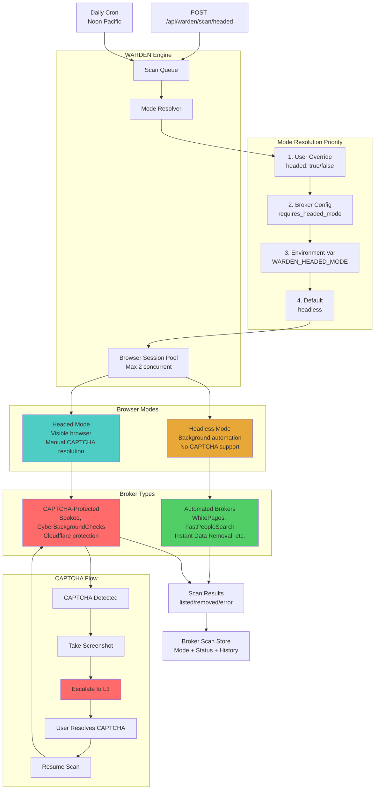

# CORTEGE — AI Security Companion System

CORTEGE is a companion-model AI security product where each household member is paired with a dedicated AI agent that silently protects them from scams, fraud, and security threats. Protection deepens over time through behavioral learning.

## 🚀 Quick Start

### Prerequisites
- Node.js 18+ and npm
- Anthropic API key ([get one here](https://console.anthropic.com/))

### Setup & Run

1. **Clone the repository**
   ```bash
   git clone https://github.com/taylorparsons/cortege-hackathon.git
   cd cortege-hackathon
   ```

2. **Start the application**
   ```bash
   ./run-local.sh
   ```
   
   The script will:
   - Check Node.js/npm installation
   - Install dependencies automatically (if needed)
   - Create `.env` from `.env.example` (if needed)
   - Prompt you to add your `ANTHROPIC_API_KEY`
   - Open two terminal windows:
     - Backend server (port 3001)
     - Frontend dev server (port 5173)

3. **Stop the application**
   ```bash
   ./stop-local.sh
   ```

### Access Points

- **Frontend UI**: http://localhost:5173
- **Backend API**: http://localhost:3001
- **API Documentation**: http://localhost:3001/api/docs
- **WebSocket**: ws://localhost:3001

## 📚 Documentation

- **[API Documentation](docs/API.md)** - Complete REST and WebSocket API reference
- **[Production Deployment](docs/PRODUCTION_DEPLOYMENT.md)** - Twilio integration and production setup
- **[PRD](docs/PRD.md)** - Product requirements and roadmap
- **[Traceability](docs/TRACEABILITY.md)** - How to follow the audit trail

## 🏗️ Architecture

### System Components

```
┌─────────────────────────────────────────────────────────────┐
│                     React Frontend (Vite)                   │
│                    http://localhost:5173                    │
└────────────────────┬────────────────────────────────────────┘
                     │ REST + WebSocket
┌────────────────────▼────────────────────────────────────────┐
│              Express.js Backend Server                      │
│                http://localhost:3001                        │
│  ┌──────────────────────────────────────────────────────┐  │
│  │              Orchestrator                            │  │
│  │  ┌────────────┐  ┌──────────────┐  ┌─────────────┐  │  │
│  │  │ Event Bus  │  │ Agent Pool   │  │  Scheduler  │  │  │
│  │  └────────────┘  └──────────────┘  └─────────────┘  │  │
│  └──────────────────────────────────────────────────────┘  │
│  ┌──────────────────────────────────────────────────────┐  │
│  │         Agent Instances (per household member)       │  │
│  │  ┌──────────┐  ┌──────────┐  ┌──────────┐          │  │
│  │  │  ANCHOR  │  │ SENTINEL │  │  SCOUT   │          │  │
│  │  │ (elderly)│  │ (adult)  │  │ (teen)   │          │  │
│  │  └──────────┘  └──────────┘  └──────────┘          │  │
│  └──────────────────────────────────────────────────────┘  │
└────────────────────┬────────────────────────────────────────┘
                     │ Claude API
┌────────────────────▼────────────────────────────────────────┐
│                  Anthropic Claude                           │
│              (Haiku 4.5 for assessments)                    │
└─────────────────────────────────────────────────────────────┘
```

### Agent Learning Stages

Agents evolve through four maturity stages:

1. **Baseline** (0.00-0.10) - Learning normal patterns
2. **Pattern Recognition** (0.10-0.30) - Identifying recurring behaviors
3. **Predictive** (0.30-0.60) - Anticipating threats
4. **Cortege Mode** (0.60-1.00) - Proactive protection

### WARDEN Data Broker Removal Agent

WARDEN is a specialized agent that automatically removes household member information from data broker websites.



**Key Features:**
- **Automatic Mode Selection**: Priority-based resolution (user override > broker config > env var > default)
- **Headless Mode**: Background automation for brokers without CAPTCHA protection
- **Headed Mode**: Visible browser for manual CAPTCHA resolution on Cloudflare-protected sites
- **CAPTCHA Escalation**: L3 escalation with screenshot when CAPTCHA detected
- **Session Management**: Max 2 concurrent browser sessions to prevent resource exhaustion
- **Audit Trail**: All scans tracked with mode, status, and timestamp in scan history

**Supported Brokers:**
- WhitePages, FastPeopleSearch, Instant Data Removal (headless)
- Spokeo, CyberBackgroundChecks (headed mode required)
- 10+ broker definitions with declarative opt-out workflows

See [WARDEN Demo Guide](docs/WARDEN_DEMO_GUIDE.md) for setup and usage.

### Event Ingestion

- **Event Simulator** - Demo scenarios (default)
- **Manual API** - POST /api/events for testing
- **Twilio Webhook** - Real phone call integration (see [Production Deployment](docs/PRODUCTION_DEPLOYMENT.md))
- **Live Feed event injector** - Targets the currently selected household members instead of the legacy hard-coded demo defaults
- **Household fraud case panel** - Links one recent household call with one manual evidence item and generates an explainable risk case

### Hackathon Demo Story

The strongest current demo is a **household-aware fraud case**, not generic phone spam blocking:

1. A real inbound call hits the household Twilio number
2. CORTEGE resolves the household and target member
3. The operator adds one manual evidence item in Live Feed
4. CORTEGE creates one case with severity, signals, rationale, and recommended action

Supported first-pass evidence inputs are intentionally text-first and conservative:

- `message_excerpt`
- `suspicious_url`
- `screenshot_note`

This flow does **not** claim definitive AI-image or AI-video detection. It uses explainable risk heuristics so the demo remains believable under hackathon time pressure.

## 🏠 Household Management

CORTEGE supports multiple households, each with independent members and companion agents.

### Switching Households

Click **"Switch Household"** in the nav bar to open the household selector. From there you can create households, switch between them, delete unused ones, manage saved locations, edit a location name/address, and reassign a household to another saved location. Referenced locations cannot be deleted until every blocking household is reassigned. Your selected household persists across page reloads via localStorage.

### Creating Households via API

```bash
# Create a named location
LOCATION_ID=$(curl -s -X POST http://localhost:3001/api/locations \
  -H 'Content-Type: application/json' \
  -d '{
    "name": "Family A Home",
    "address": {
      "line1": "123 Main St",
      "line2": null,
      "city": "New York",
      "region": "NY",
      "postal_code": "10001",
      "country": "US"
    }
  }' | jq -r '.location_id')

# Create a household
curl -X POST http://localhost:3001/api/households \
  -H 'Content-Type: application/json' \
  -d "{\"name\": \"Family A\", \"location_id\": \"$LOCATION_ID\"}"

# Add a member
curl -X POST http://localhost:3001/api/households/<id>/members \
  -H 'Content-Type: application/json' \
  -d '{
    "name": "Alex",
    "phone": "+14155550123",
    "date_of_birth": "2012-05-14",
    "profile_type": "child",
    "companion": "scout"
  }'
```

### Migrating from Legacy Format

If you have an existing `data/household.json`, migrate it to the multi-household store:

```bash
node scripts/migrate-household.js
```

This will:
- Read the legacy `data/household.json`
- Create a new household in `data/households/`
- Migrate all members
- Back up the original as `data/household.json.backup`

The legacy `GET /api/household` endpoint continues to work — it falls back through: household store (by `DEFAULT_HOUSEHOLD_ID`) → first available household → legacy `household.json` → empty default.

### Environment Variables

```bash
DEFAULT_HOUSEHOLD_ID=<uuid>  # Optional: default household for legacy endpoint
```

### Privacy Model

The current household data model is privacy-first:

- Household and location records use `location_id` references instead of embedding a freeform household `location`
- Member full name, phone, and `date_of_birth` are encrypted at rest
- Saved location name and structured address are encrypted at rest
- Logs and external LLM calls use redacted or aliased values instead of raw PII

For production deployments, set a strong `PII_MASTER_KEY`. In development, the server falls back to a dev-only key if it is unset.

### Stable Companion Identity

Companion runtime instances are keyed by the stable `member.id`, not by the member display name. That matters for demo reliability:

- A newly created `Sam Dodge` does not inherit another `Sam Dodge`'s old memory or activity
- Live companion activity starts from that member's actual creation time
- The selected-household Live Feed and Household detail surfaces stay aligned to the same member identity

## 🛠️ Development

### Storage

CORTEGE uses SQLite for production storage with tamper-evident audit trail.

#### Storage Modes

Configure via `STORAGE_MODE` environment variable:

- **sqlite** (default) - Production mode with tamper-evident hash chain
- **json** - Legacy mode using JSON files (for development)
- **dual-write** - Write to both SQLite and JSON (for migration)

#### Environment Variables

```bash
# Storage configuration
STORAGE_MODE=sqlite                      # sqlite | json | dual-write
SQLITE_DB_PATH=data/cortege.db          # SQLite database path
ENABLE_JSON_FALLBACK=false              # Fall back to JSON on SQLite errors
```

#### Migration from JSON

To migrate existing JSON files to SQLite:

```bash
node scripts/migrate-to-sqlite.js
```

The migration script will:
- Backup existing SQLite database (if it exists)
- Import all events from `data/events/*.jsonl`
- Reconstruct hash chain for tamper evidence
- Import memory snapshots from `data/memories/*.json`
- Validate hash chain integrity
- Report progress and errors

#### Hash Chain Validation

Validate event log integrity:

```bash
node scripts/validate-hash-chain.js
```

This verifies:
- Each event's hash is correctly computed
- Each event's prev_hash matches the previous event's hash
- No events have been tampered with or deleted

Run this daily in production (e.g., via cron job) to ensure audit trail integrity.

#### SQLite Features

- **Tamper-evident**: Append-only event log with SHA-256 hash chain
- **Atomic writes**: Events and memory snapshots written in transactions
- **Query capabilities**: Filter by member, threat level, time range, signals
- **Crash recovery**: WAL (Write-Ahead Logging) mode enabled
- **Security**: Database file permissions set to 0600 (owner read/write only)

### Project Structure

```
cortege-hackathon/
├── .kiro/                              # Kiro IDE configuration and specs
│   └── specs/                          # Implementation specifications
│       ├── agent-orchestration-implementation/  # Main implementation spec
│       │   ├── requirements.md         # 48 FR + 15 NFR requirements
│       │   └── tasks.md                # 10 phases, 100+ granular tasks
│       └── agent-orchestration-mvp/    # MVP specification
│           ├── requirements.md         # MVP requirements subset
│           └── tasks.md                # MVP task breakdown
│
├── agents/                             # Agent templates (markdown) - swappable layer
│   ├── _template/                      # Template for creating new agents
│   │   └── agent.md                    # Starter template with examples
│   ├── anchor/                         # Elderly protection agent
│   │   └── agent.md                    # YAML frontmatter + markdown prompt
│   ├── sentinel/                       # Adult protection agent
│   │   └── agent.md                    # Primary household coordinator
│   └── scout/                          # Teen protection agent
│       └── agent.md                    # Age-appropriate threat detection
│
├── data/                               # Runtime data storage (gitignored)
│   ├── cortege.db                      # SQLite database (primary storage)
│   ├── events/                         # Event logs (legacy JSON mode only)
│   │   └── YYYY-MM-DD.jsonl           # One file per day, one event per line
│   ├── memories/                       # Agent memory stores (legacy JSON mode only)
│   │   ├── anchor-member-001.json     # Per-agent-instance learning
│   │   ├── sentinel-member-002.json   # Trusted contacts, patterns, history
│   │   └── scout-member-003.json      # Grows over time = learning
│   ├── households/                     # Multi-household JSON files
│   │   └── <uuid>.json               # One file per household (members, config)
│   ├── locations/                      # Saved named locations (JSON mode)
│   │   └── <uuid>.json               # One file per saved location
│   └── household.json                  # Legacy single-household file (backward compat)
│
├── docs/                               # Documentation
│   ├── API.md                          # Complete REST + WebSocket API reference
│   ├── PRD.md                          # Product requirements and roadmap
│   ├── PRODUCTION_DEPLOYMENT.md        # Twilio integration + production setup
│   ├── TRACEABILITY.md                 # Audit trail navigation guide
│   ├── requests.md                     # Customer request log (CR-*)
│   ├── decisions.md                    # Design decision log (D-*)
│   ├── progress.txt                    # Execution log (session notes)
│   ├── specs/                          # Feature specifications
│   │   ├── 20260319-add-household-feature/  # Multi-household management
│   │   │   ├── spec.md                 # 10 FRs, 3 NFRs, acceptance scenarios
│   │   │   └── tasks.md                # 17 tasks (16 done, 1 deferred)
│   │   ├── 20260319-frontend-api-integration/ # Live API data in frontend
│   │   │   ├── spec.md
│   │   │   └── tasks.md
│   │   ├── working-demo-with-twilio/   # Twilio integration spec
│   │   │   ├── spec.md                 # Requirements + acceptance criteria
│   │   │   └── tasks.md                # Implementation tasks
│   │   └── ...                         # Additional feature specs
│   └── superpowers/                    # Design specifications (architecture)
│       ├── specs/
│       │   ├── 2026-03-14-agent-orchestration-design.md    # Agent system design
│       │   ├── 2026-03-14-agent-orchestration-diagrams.md  # Agent system diagrams
│       │   ├── 2026-03-19-household-management-design.md   # Household design
│       │   └── 2026-03-19-household-management-diagrams.md # Household diagrams
│       └── plans/                      # Implementation plans
│           ├── 2026-03-19-add-household-feature.md
│           ├── 2026-03-19-frontend-api-integration.md
│           └── 2026-03-18-sqlite-auditability.md
│
├── scenarios/                          # Demo scenario definitions (JSON)
│   ├── _template.json                  # Template for creating scenarios
│   ├── grandparent-scam.json          # Emergency scam targeting elderly
│   ├── bank-fraud.json                # Fake bank security call
│   └── tech-support.json              # Tech support scam
│
├── scripts/                            # Utility scripts
│   ├── migrate-household.js           # Migrate legacy household.json to multi-household
│   ├── migrate-to-sqlite.js           # Migrate JSON files to SQLite
│   └── validate-hash-chain.js         # Verify audit trail integrity
│
├── server/                             # Backend (Node.js/Express) - the framework
│   ├── index.js                        # Server entry point
│   ├── agents/                         # Agent runtime
│   │   ├── agent-factory.js           # Scans agents/ dir, parses templates
│   │   ├── agent-instance.js          # Per-member agent instance
│   │   ├── template-parser.js         # YAML frontmatter + markdown parser
│   │   ├── memory-store.js            # JSON memory persistence + depth calc
│   │   └── household.js               # Household config loader
│   ├── api/                            # REST + WebSocket
│   │   ├── routes.js                  # Express REST endpoints
│   │   └── websocket.js               # Real-time event push
│   ├── privacy/                        # PII protection helpers
│   │   └── pii.js                     # Encryption, tokenization, redaction, LLM sanitization
│   ├── claude/                         # Claude API client
│   │   ├── claude-client.js           # @anthropic-ai/sdk wrapper
│   │   └── response-schema.js         # submit_assessment tool definition
│   ├── escalation/                     # Threat escalation
│   │   └── escalation-handler.js      # L0-L4 routing + household relay
│   ├── ingestion/                      # Event ingestion
│   │   ├── twilio-webhook.js          # POST /ingest/twilio/voice
│   │   ├── simulator.js               # Scenario playback engine
│   │   └── manual.js                  # POST /api/events
│   ├── orchestrator/                   # Core orchestration
│   │   ├── orchestrator.js            # Main coordinator
│   │   ├── event-bus.js               # Typed EventEmitter + SQLite persistence
│   │   └── scheduler.js               # node-cron for timed tasks
│   ├── storage/                        # Storage layer
│   │   ├── schema.sql                 # SQLite schema with triggers
│   │   ├── db.js                      # Database connection + queries
│   │   ├── hash-chain.js              # SHA-256 hash chain computation
│   │   ├── household-store.js         # Multi-household JSON file store
│   │   ├── location-store.js          # Saved-location JSON file store
│   │   └── storage-adapter.js         # Multi-mode storage (sqlite/json/dual)
│   └── tests/                          # Node.js test suite
│       ├── integration.test.js        # End-to-end flows
│       ├── demo-validation.test.js    # Demo scenario validation
│       ├── template-parser.test.js    # Agent template parsing
│       ├── event-bus.test.js          # Event bus + persistence
│       ├── memory-store.test.js       # Learning + depth calculation
│       ├── escalation-handler.test.js # Threat routing
│       ├── db.test.js                 # SQLite database operations
│       ├── hash-chain.test.js         # Hash chain computation
│       ├── sqlite-triggers.test.js    # Append-only trigger validation
│       ├── privacy.test.js            # PII encryption, tokenization, redaction
│       ├── location-store.test.js     # Saved-location storage coverage
│       ├── household-store.test.js    # Household store CRUD (8 tests)
│       ├── household-api.test.js      # Household API endpoints (8 tests)
│       └── household-integration.test.js # Household end-to-end (4 tests)
│
├── src/                                # Frontend (React + Vite)
│   ├── main.jsx                        # React entry point (HouseholdProvider wrapper)
│   ├── Cortege.jsx                     # Main dashboard component
│   ├── components/                     # UI components
│   │   ├── EventFeed.jsx              # Real-time event stream
│   │   ├── AgentStatus.jsx            # Companion status cards
│   │   ├── HouseholdSelector.jsx      # Household switching modal
│   │   ├── LocationManager.jsx        # Saved-location list/edit/delete UI
│   │   ├── MemoryViewer.jsx           # Agent memory inspector
│   │   ├── ScenarioRunner.jsx         # Demo scenario controls
│   │   └── EventInjector.jsx          # Manual event submission
│   ├── context/                        # React contexts
│   │   └── HouseholdContext.jsx       # Current household state + localStorage
│   ├── hooks/                          # Custom React hooks
│   │   ├── useCortegeData.js          # REST + WebSocket data (household-scoped)
│   │   ├── useCompanionDetail.js      # Companion detail panel data
│   │   └── useHouseholds.js           # Household CRUD operations
│   └── lib/                            # Shared utilities
│       ├── backend-url.js             # API/WS URL helper (proxy-aware)
│       └── companion-display.js       # Agent type → display properties
│
├── .env                                # Environment config (gitignored)
├── .env.example                        # Environment template
├── package.json                        # Node.js dependencies
├── vite.config.js                      # Vite build config
├── run-local.sh                        # Start script (opens 2 terminals)
└── stop-local.sh                       # Stop script (kills ports 3001 + 5173)
```

### Running Tests

```bash
# Run all tests
npm test

# Run unit tests only
npm run test:unit

# Run integration tests only
npm run test:integration
```

### Localhost Cypress Review Artifacts

With the backend on `http://localhost:3001` and the frontend on `http://localhost:5173`, rerun the current household/member demo review path with:

```bash
npx cypress run --spec cypress/e2e/navigation.cy.js,cypress/e2e/household-crud.cy.js,cypress/e2e/member-crud.cy.js,cypress/e2e/companion-cards.cy.js,cypress/e2e/live-feed.cy.js,cypress/e2e/fraud-case-demo.cy.js
```

The latest recorded localhost review suite passed with `24` tests across `6` specs and writes reviewer-friendly artifacts to `cypress/screenshots/` and `cypress/videos/`.

Core screenshots from the exact recorded suite:

- [Navigation screenshot](cypress/screenshots/navigation.cy.js/Navigation%20--%20renders%20all%204%20nav%20tabs.png)
- [Household routing editor screenshot](cypress/screenshots/household-crud.cy.js/Household%20CRUD%20--%20saves%20Twilio%20routing%20numbers%20and%20primary%20member%20from%20the%20household%20editor.png)
- [Member CRUD screenshot](cypress/screenshots/member-crud.cy.js/Member%20CRUD%20--%20adds%20a%20member%20and%20the%20member%20row%20appears.png)
- [Selected-household companion screenshot](cypress/screenshots/companion-cards.cy.js/Companion%20Cards%20--%20shows%20companion%20cards%20for%20the%20selected%20household%20members.png)
- [Live Feed screenshot](cypress/screenshots/live-feed.cy.js/Live%20Feed%20--%20event%20injector%20target%20list%20uses%20the%20selected%20household%20members.png)
- [Fraud case demo screenshot](cypress/screenshots/fraud-case-demo.cy.js/Fraud%20Case%20Demo%20--%20creates%20a%20household%20fraud%20case%20from%20a%20recent%20Twilio%20call%20and%20one%20evidence%20item.png)


Recorded videos from the same suite:

- [Navigation run video](cypress/videos/navigation.cy.js.mp4)
- [Household CRUD run video](cypress/videos/household-crud.cy.js.mp4)
- [Member CRUD run video](cypress/videos/member-crud.cy.js.mp4)
- [Companion cards run video](cypress/videos/companion-cards.cy.js.mp4)
- [Live Feed run video](cypress/videos/live-feed.cy.js.mp4)
- [Fraud case demo run video](cypress/videos/fraud-case-demo.cy.js.mp4)

### Creating New Agents

Agents are defined as markdown files with YAML frontmatter:

1. Create `agents/my-agent/agent.md`
2. Define configuration in YAML frontmatter
3. Write system prompt in markdown body
4. Restart the orchestrator

See existing agents in `agents/` for examples.

### Running Scenarios

```bash
# Via API
curl -X POST http://localhost:3001/api/scenarios/grandparent-scam/run

# Available scenarios
ls scenarios/*.json
```

## 🔧 Configuration

### Environment Variables

```bash
# Required
ANTHROPIC_API_KEY=your_api_key_here

# Optional
CLAUDE_MODEL=claude-haiku-4-5-20251001  # Default model
PORT=3001                                # Backend port
PII_MASTER_KEY=                          # Required in production for encrypted household/member/location PII

# Demo/Learning Acceleration
LEARNING_TIME_MULTIPLIER=1440            # 1 min = 1 day (default)
LEARNING_EVENT_WEIGHT=10                 # Event depth multiplier
LEARNING_FAST_MODE=true                  # Lower stage thresholds

# Twilio (for production)
TWILIO_ACCOUNT_SID=your_sid
TWILIO_AUTH_TOKEN=your_token

# Household
DEFAULT_HOUSEHOLD_ID=                    # Default household for legacy endpoint

# Debug
CLAUDE_DEBUG=1                           # Enable API debug logging
```

## 📊 API Endpoints

### Household Management

- `POST /api/households` - Create a new household
- `GET /api/households` - List all households
- `GET /api/households/:id` - Get household by ID
- `PUT /api/households/:id` - Update household
- `DELETE /api/households/:id` - Delete household
- `POST /api/households/:id/members` - Add member to household
- `PUT /api/households/:id/members/:mid` - Update member
- `DELETE /api/households/:id/members/:mid` - Remove member
- `GET /api/household` - Legacy endpoint (backward-compatible fallback)

### Location Management

- `GET /api/locations` - List saved locations
- `POST /api/locations` - Create a saved location with a name and structured address
- `GET /api/locations/:id` - Get saved location details
- `PUT /api/locations/:id` - Update saved location name/address
- `DELETE /api/locations/:id` - Delete a saved location if no household still references it (`409 Conflict` when blocked)

### Companions

- `GET /api/companions` - Get all agent instances
- `GET /api/companions/:id` - Get specific agent
- `GET /api/companions/:id/memory` - Get agent memory
- `GET /api/companions/:id/activity` - Get agent activity log

### Events & Scenarios

- `GET /api/events` - Get recent events
- `POST /api/events` - Submit manual event
- `GET /api/fraud-cases?household_id=...` - List recent fraud cases for a household
- `POST /api/fraud-cases` - Create a household fraud case from one linked event and one evidence item
- `POST /api/scenarios/:name/run` - Run demo scenario

### Agents

- `GET /api/agents` - List loaded agents
- `POST /api/agents/reload` - Hot-reload agent templates

### Documentation

- `GET /api/docs` - API documentation (HTML)

See [API.md](docs/API.md) for complete reference with examples.

## 🔌 WebSocket Events

Connect to `ws://localhost:3001` to receive real-time updates:

```javascript
const ws = new WebSocket('ws://localhost:3001');

ws.onmessage = (event) => {
  const message = JSON.parse(event.data);
  
  switch (message.type) {
    case 'event':           // New event ingested
    case 'assessment':      // Agent assessment completed
    case 'memory_update':   // Agent memory updated
    case 'escalation':      // Threat escalated
    case 'error':           // Error occurred
  }
};
```

## 🧪 Demo Scenarios

Pre-built scenarios in `scenarios/`:

- **grandparent-scam.json** - Emergency scam targeting elderly
- **bank-fraud.json** - Fake bank security call
- **tech-support.json** - Tech support scam

Run via API or add your own JSON scenario files.

## 🚨 Threat Levels

Agents assess threats on a 5-level scale:

- **L0** - Benign (normal activity)
- **L1** - Suspicious (monitor)
- **L2** - Likely threat (warn)
- **L3** - High confidence threat (block)
- **L4** - Critical threat (block + escalate)

## 📝 Scripts

### run-local.sh

Starts both backend and frontend in separate terminal windows for easy log monitoring.

**Features:**
- Checks Node.js/npm installation
- Installs dependencies if needed
- Validates .env configuration
- Creates data directory
- Opens two terminal windows (backend + frontend)

**Usage:**
```bash
./run-local.sh
```

### stop-local.sh

Kills processes on ports 3001 (backend) and 5173 (frontend).

**Features:**
- Finds PIDs using each port
- Gracefully terminates processes
- Confirms successful shutdown

**Usage:**
```bash
./stop-local.sh
```

## 🤝 Contributing

This is a hackathon project. For production use:

1. Add authentication (API keys, JWT)
2. Implement rate limiting
3. Add CORS configuration
4. Set up proper logging
5. Configure production database
6. Add monitoring/alerting
7. Implement backup/recovery

See [PRODUCTION_DEPLOYMENT.md](docs/PRODUCTION_DEPLOYMENT.md) for details.

## 📄 License

This project is proprietary, not open source, and all rights are reserved. See
[`LICENSE`](LICENSE).

## 🙏 Acknowledgments

- Built with [Anthropic Claude](https://www.anthropic.com/)
- Event-driven architecture inspired by actor model patterns
- Agent learning system based on behavioral analysis research

## 📞 Support

- **Issues**: [GitHub Issues](https://github.com/taylorparsons/cortege-hackathon/issues)
- **Documentation**: See `docs/` directory
- **API Reference**: http://localhost:3001/api/docs (when running)

---

**Built for hackathon - March 2026**
