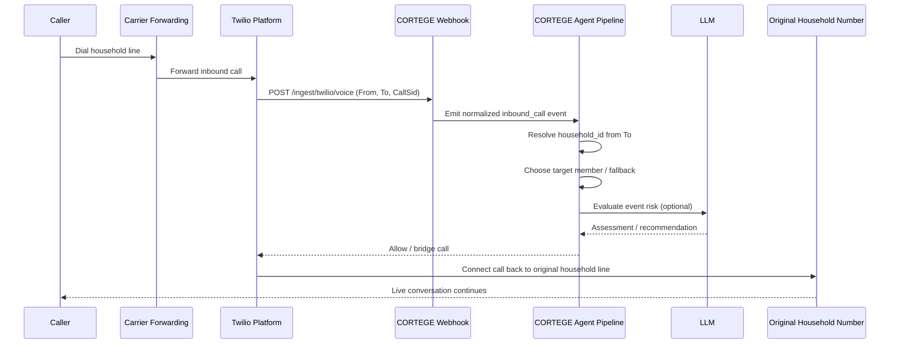
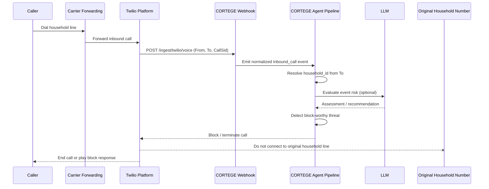

# CORTEGE Twilio Demo Guide

## Overview

This guide defines the Twilio model for the current hackathon demo.

The demo uses **one Twilio number per household**.
That Twilio number is the household's ingress point and is mapped to a single `household_id`.

Current code status:
- The Twilio webhook route exists at `POST /ingest/twilio/voice`
- The webhook is still a stub and does not yet emit live events to the event bus
- This guide describes the target implementation and the demo setup we are aiming to finish next

## Recommended Demo Model

### Routing rule

- `To` number -> `household_id`
- The matched household becomes the active routing context for the inbound event
- Member-level targeting happens inside that household after the household is identified

### Why this model

- simplest demo story
- deterministic routing
- matches the shipped multi-household product model
- avoids the ambiguity of many people forwarding into one shared Twilio number

### Data model expectations

For the Twilio demo flow, each household needs:
- `household_id`
- `name`
- `location_id`
- `twilio_number` in E.164 format

Members stay household-scoped records. A member phone number may still exist, but the basic Twilio household-ingress demo does not depend on member phone numbers for the first routing decision.

## End-to-End Flow

1. A household is assigned a Twilio number.
2. A real-world household contact number or designated demo line forwards incoming calls to that Twilio number.
3. Twilio sends the inbound call webhook to CORTEGE.
4. CORTEGE reads the webhook `To` number and resolves the household by `twilio_number`.
5. CORTEGE creates a normalized inbound-call event for that household.
6. CORTEGE routes the event to the correct companion or household fallback rule.
7. The Household tab and Live Feed show the event and the companion response.

## Household Routing Rules

The first routing step is always household resolution from the Twilio number. After that, use this order:

1. If the webhook or scenario includes an explicit target member, route to that member.
2. Otherwise, route to the household primary member.
3. Otherwise, route by household policy or event type.
4. If no member can be chosen safely, create a household-level unresolved event.

For the hackathon, the second rule is enough: default to the household primary member.

## Sequence Diagrams

These diagrams show the **target Twilio demo behavior**.
They explain the intended call outcome after CORTEGE evaluates the inbound call.

Legend:
- `Twilio Platform` is Twilio-managed behavior
- `CORTEGE Webhook` is the `POST /ingest/twilio/voice` server route
- `CORTEGE Agent Pipeline` is CORTEGE event routing and companion processing
- `LLM` is an optional downstream model call made by the companion pipeline, not by Twilio

### Allowed Call: Bridged Back to the Original Household Line



### Blocked Call: Terminated Before Household Delivery



## Localhost Demo Setup

### Prerequisites

- local frontend running on `http://localhost:5173`
- local backend running on `http://localhost:3001`
- ngrok or equivalent HTTPS tunnel to port `3001`
- Twilio account with one voice-capable number for the demo household

### Step 1: Start CORTEGE locally

```bash
npm run server
npm run dev
```

### Step 2: Start ngrok

```bash
ngrok http 3001
```

Copy the generated HTTPS URL.

### Step 3: Buy or choose the household Twilio number

In Twilio Console:
1. Go to **Phone Numbers**
2. Buy or select one voice-capable number
3. Reserve that number for one demo household

### Step 4: Configure the webhook

For the Twilio number:
1. Open **Phone Numbers** -> **Manage** -> **Active Numbers**
2. Click the selected number
3. Under **A Call Comes In**, set:
   - URL: `https://<your-ngrok-domain>/ingest/twilio/voice`
   - Method: `POST`

### Step 5: Map the number to a household

The demo household record should store the same Twilio number in E.164 form.

Example target shape:

```json
{
  "household_id": "hh_demo1234",
  "name": "Dodge Household",
  "location_id": "loc_demo5678",
  "twilio_number": "+15559990000"
}
```

The current shipped household store does not yet expose this field. Adding and wiring `twilio_number` is the next implementation step.

### Step 6: Forward the real-world household line

Forward the household's real-world number to the Twilio number.

For the hackathon, this can be:
- a household landline
- a shared family number
- a designated demo phone line

The important part is that the forwarded destination is the household's Twilio number.

## Twilio Webhook Expectations

The target Twilio voice flow should:
- validate `CallSid`, `From`, and `To`
- validate the Twilio signature when `TWILIO_AUTH_TOKEN` is configured
- normalize the inbound payload into a CORTEGE event
- resolve the household from `To`
- emit the event to the event bus
- return quickly so Twilio does not time out

Example normalized event shape:

```json
{
  "type": "inbound_call",
  "source": "twilio",
  "household_id": "hh_demo1234",
  "payload": {
    "caller_id": "+14155550123",
    "twilio_call_sid": "CA123",
    "target_member": null,
    "transcript": null
  }
}
```

## Privacy Requirements

Twilio docs must follow the shipped privacy model.

That means:
- do not log raw phone numbers in clear text
- use aliases or redacted forms in logs
- do not tell operators to update legacy `household.json` with plaintext phone data
- treat household/member/location data as coming from the current household and location stores

## Environment Variables

Required for Twilio demo work:

```env
ANTHROPIC_API_KEY=<key>
TWILIO_ACCOUNT_SID=<sid>
TWILIO_AUTH_TOKEN=<token>
PII_MASTER_KEY=<key>
PORT=3001
LEARNING_TIME_MULTIPLIER=1
LEARNING_EVENT_WEIGHT=1
LEARNING_FAST_MODE=false
NODE_ENV=development
```

## What Is In Scope Now

- one Twilio number per household
- localhost demo through ngrok
- inbound voice webhook
- household resolution from `To`
- household-primary-member fallback routing

## What Is Out of Scope For This Demo

- one Twilio number shared across many households
- one Twilio number per member
- number porting
- mobile-app call interception
- carrier partnerships
- SMS ingestion

## Troubleshooting

### Webhook returns 400

Likely cause:
- missing `CallSid`, `From`, or `To`

### Webhook returns 403

Likely cause:
- invalid Twilio signature

### Webhook resolves no household

Likely cause:
- Twilio number is not mapped to any household record
- stored number format does not match E.164

### Event lands in the wrong household

Likely cause:
- more than one household is sharing a Twilio number
- household mapping data is stale

### No event appears in UI

Likely cause:
- webhook is still stubbed and not yet wired to `eventBus.emit()`
- frontend is not pointed at the running backend
- selected household does not match the routed household
