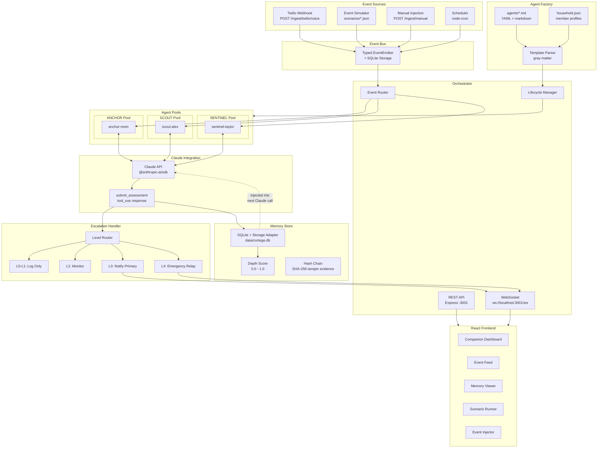
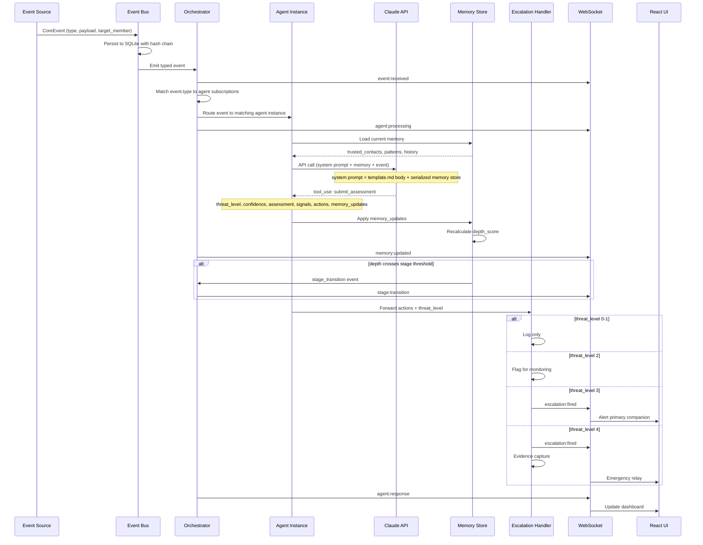
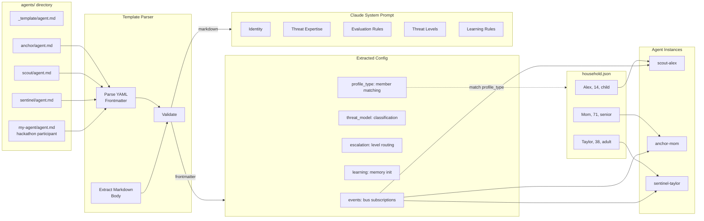
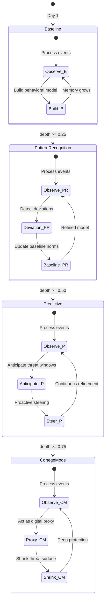
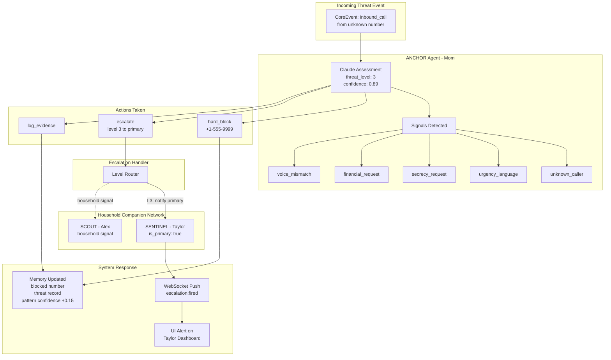
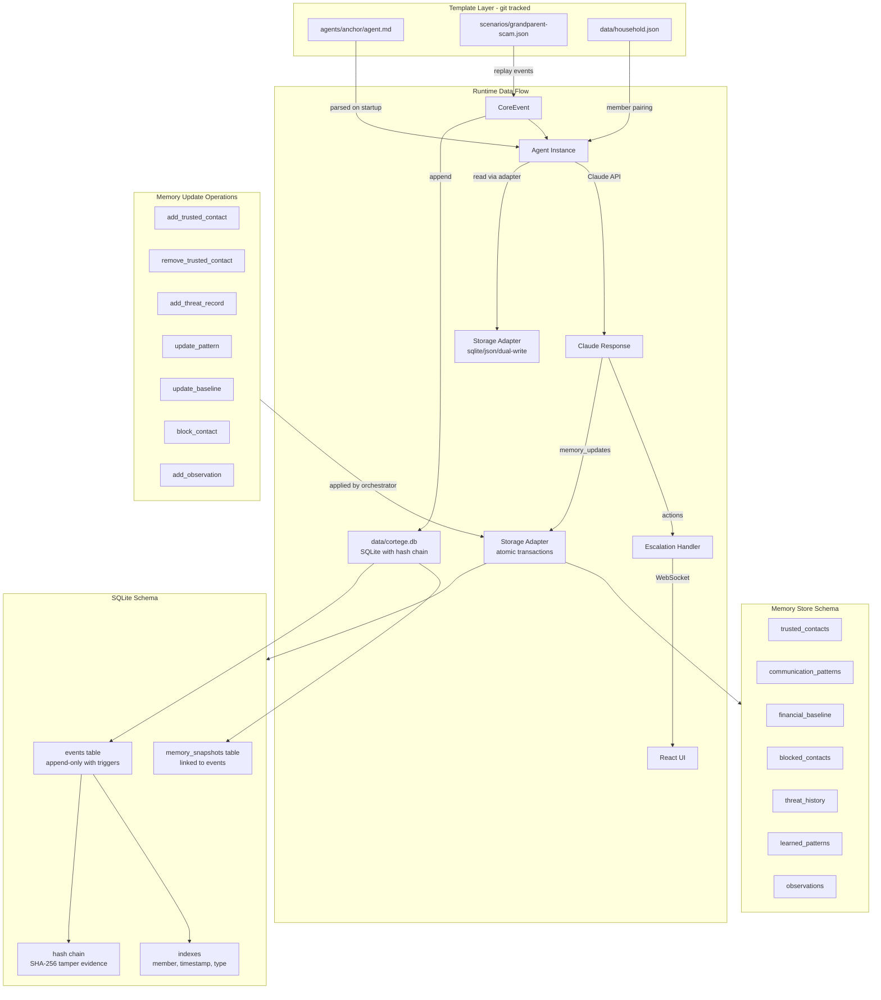
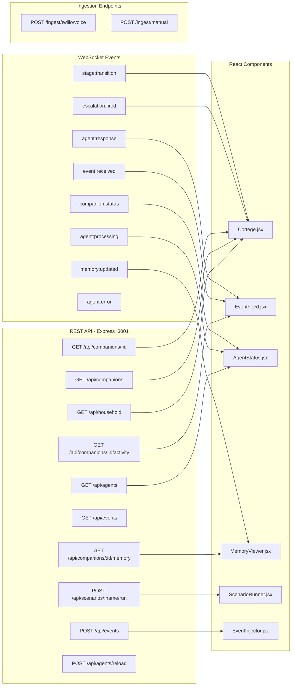

# Agent Orchestration System — System Diagrams

Companion diagrams for the [Agent Orchestration Design Spec](2026-03-14-agent-orchestration-design.md).

## 1. System Architecture Overview

## 2. Event Processing Flow

## 3. Agent Factory and Template Processing

## 4. Learning and Depth Curve

## 5. Escalation and Household Relay

## 6. Data Flow and Storage

## 7. API Surface

