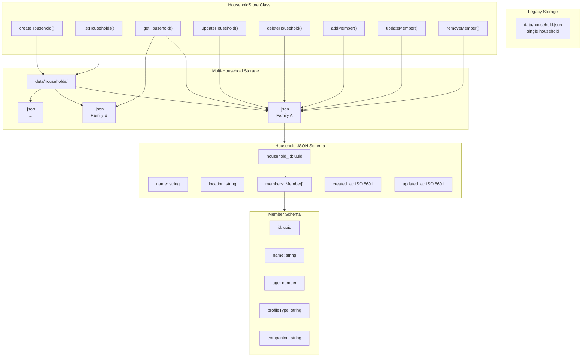
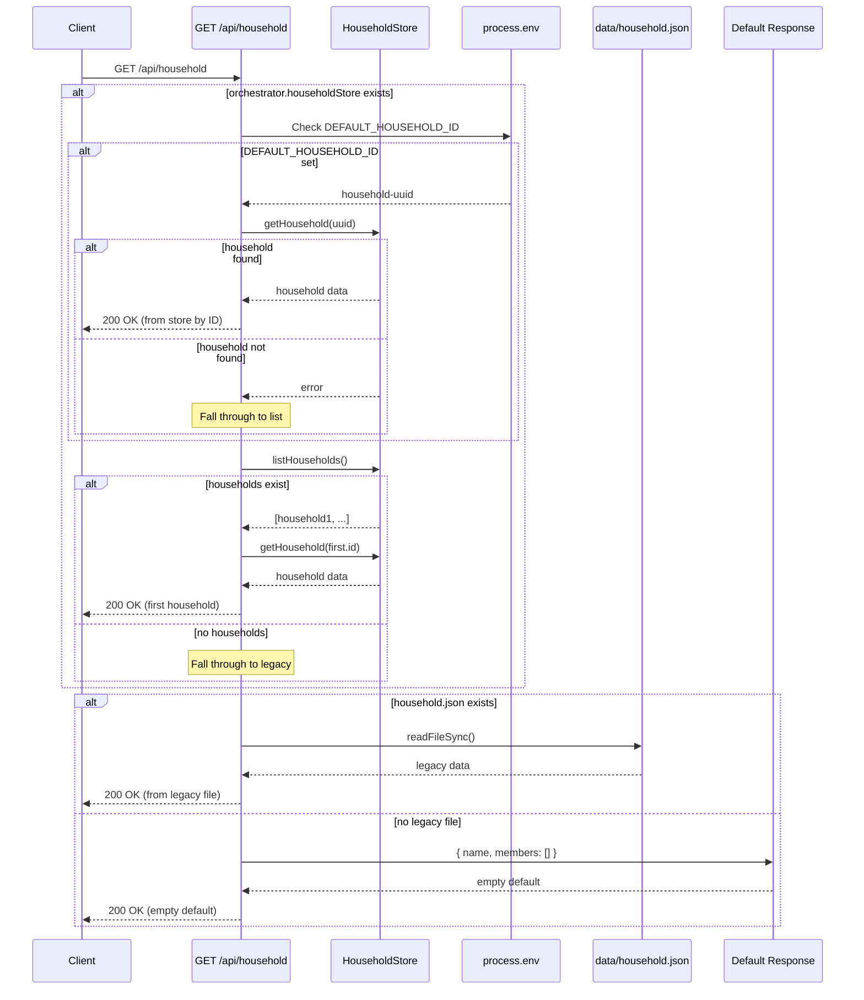
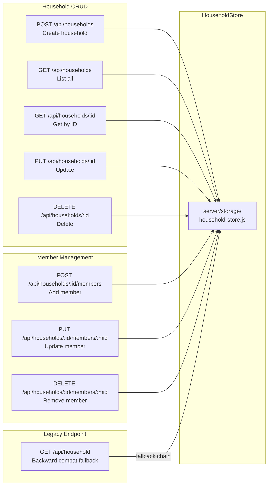
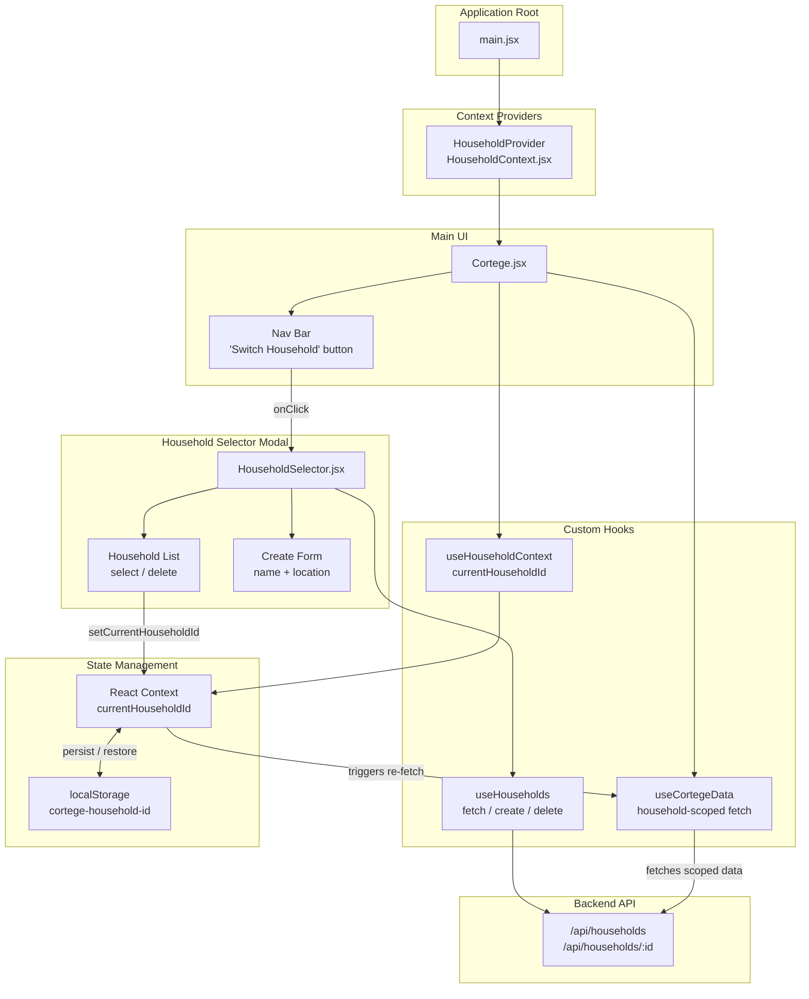
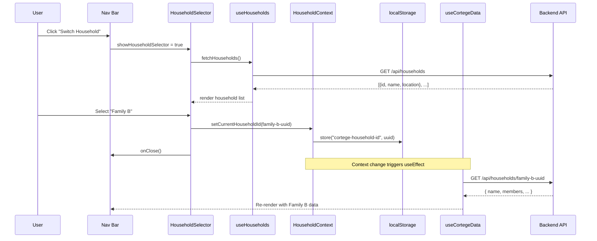
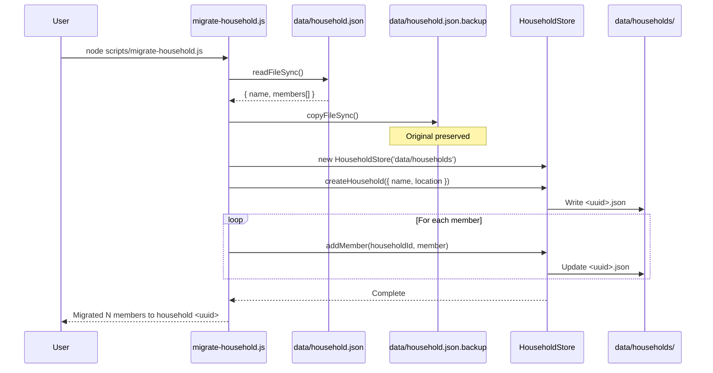
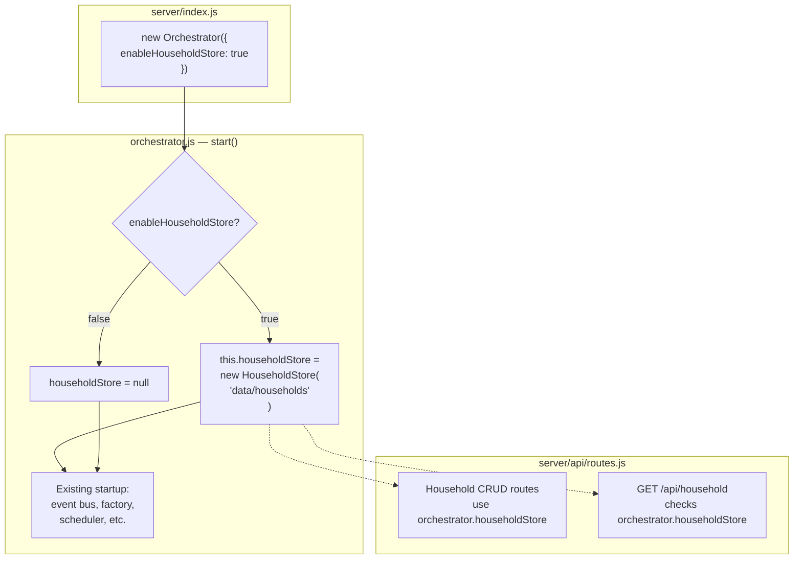

# Multi-Household Management — System Diagrams

Companion diagrams for the [Household Management Design Spec](2026-03-19-household-management-design.md).

## 1. Storage Architecture

## 2. Backward Compatibility Fallback Chain

## 3. API Endpoint Map

## 4. Frontend Component Architecture

## 5. Household Switching Data Flow

## 6. Migration Flow

## 7. Orchestrator Integration

